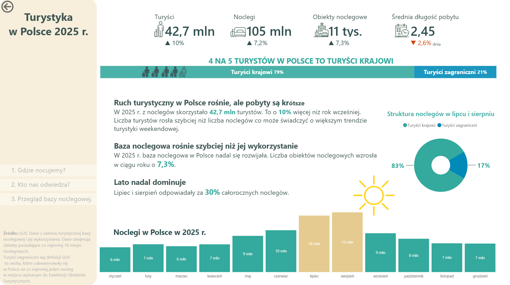

# Tourism in Poland 2025 - Power BI
Interactive Power BI analysis of tourism in Poland based on official Statistics Poland (GUS) data.
## Live report

[▶ View interactive Power BI report]([https://app.powerbi.com/view?r=eyJrIjoiYjVkZTg1NjgtNzkzZC00NGJlLTgxODMtZDdjMGE1MTc4NDM5IiwidCI6IjNkZmU5YWI2LTgxYmYtNDkxYy1iNjcwLTAxYzgyNGEwOWUxOSJ9&embedImagePlaceholder=true)

## Dashboard preview

## Project overview

This project analyses tourism in Poland in 2025 using official data from Statistics Poland (GUS).

The report focuses on tourism demand, domestic and international visitors, regional differences, accommodation capacity and seasonal patterns.

The goal was to transform multiple statistical datasets into a clear and interactive Power BI report that allows users to explore both national and regional tourism trends.

## Key questions

- How did tourism in Poland change compared with 2024?
- Which regions attract the most tourists?
- What is the share of domestic and international tourism?
- Which countries generate the most foreign visitors?
- How seasonal is tourism in Poland?
- How do accommodation capacity and utilization differ across regions?

## Key insights

- Approximately **42.7 million tourists stayed in registered accommodation establishments in Poland in 2025**, around **10% more than in 2024**.
- Domestic tourists accounted for approximately **79% of tourists using accommodation establishments**, while international tourists represented **21%**.
- July and August together generated around **30% of annual overnight stays**, confirming strong seasonality.
- Despite growing tourist volumes, the **average length of stay decreased**, suggesting a shift toward shorter trips.

## Data source

The analysis is based on official data from **Statistics Poland (GUS)**, primarily from the Local Data Bank (BDL).

The datasets cover tourism demand, domestic and international tourists, overnight stays, accommodation establishments, occupancy rates and regional population statistics.

Data for different time granularities and territorial levels were transformed and integrated in Power Query before being loaded into the Power BI data model.

## Data model

The Power BI model combines multiple fact tables with shared dimension tables, allowing analysis by time, region, country of origin and tourism indicators.

Main dimensions:
- `DimDate`
- `Dim_Terytorium`
- `Dim_Kraje`
- `Dim_Wskaźnik`

The model separates monthly and annual statistics where necessary to avoid incorrect aggregation and double counting.

## Data preparation

Data preparation was performed in **Power Query**. The main transformations included:

- cleaning and restructuring Statistics Poland datasets,
- promoting multi-row headers and standardizing column names,
- unpivoting year and month columns,
- filtering territorial aggregates to avoid double counting,
- combining datasets with different structures and granularities,
- creating consistent region, country and date identifiers,
- preparing fact and dimension tables for the Power BI model.

## DAX

DAX measures were created for dynamic KPIs, year-over-year comparisons, regional rankings and tourism intensity indicators.

Examples include:

- total tourists and overnight stays,
- domestic vs international tourist share,
- year-over-year growth,
- accommodation occupancy,
- overnight stays per 1,000 inhabitants,
- dynamic regional rankings,
- previous-year comparisons using the Date dimension.

## Tools

- **Power BI** — data modelling and visualization
- **Power Query** — ETL and data transformation
- **DAX** — measures and analytical calculations
- **Statistics Poland (GUS / BDL)** — primary data source
